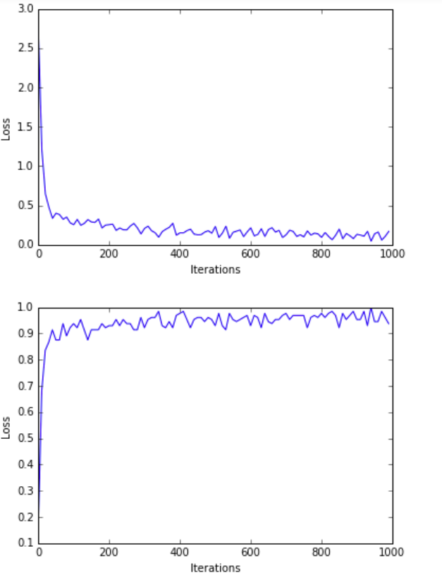
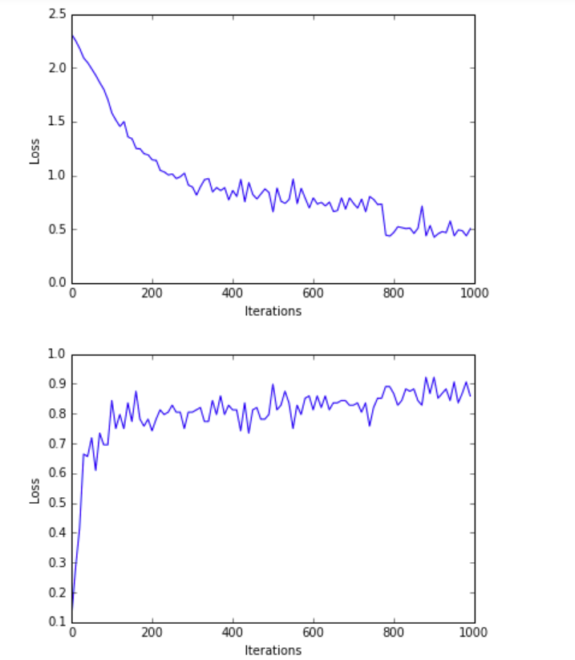

# Project Title
Digit Classification using Two Layer Neural Network and Back Propagation. Written in Python and depends only on Numpy
                                  


## Getting Started
These instructions will showcase how to access the data, train and test the model.

## Getting Data
1) Download the data in csv format from here :- https://pjreddie.com/projects/mnist-in-csv/.
2) Already downloaded and kept the MNIST test data in the ./data/ folder. Training data size was huge for Github.

## Loading the data
1) Python script, dataloader.py helps in converting the data from csv to numpy format.
2) Verify your above steps are correct by running the script
3) The script requires two user inputs
  i) datapath = path to the data folder inside which the MNIST CSVs files are stored. <br />
  ii) mode = 'train' or 'test' to extract the training or test data<br />
  iii) For example :-<br />
      ```python
          python dataloader.py ./data test
       ```
 
## Training the model
1) Python Script , nn.py contains all the APIs used for training the model, saving the model and running over the test data
2) The script requires three user inputs<br />
    i)   mode = 'train' or 'test' <br />
    ii)  datapath = path to the data folder inside which the MNIST CSVs files are stored. <br />
    iii) modelpath = path to store the trained weight or load the weights during the test time <br />
    
    iv) Example:-
    
        ```python
            python nn.py train ./data ./new_model
        ```
        
    v) Caution:-
        
        If you see the following exception:- 
                Exception : Not able to parse MNIST Data
        Please download the mnist_train.csv from the above mentioned link.

## Testing the model
1) I have already provided the trained model inside the model folder and the test data inside the data folder.
2) To get started, use the follwing command.
    
    ```python
        python nn.py test ./data ./model_bn
    ```

  If everything is set-up well, you should see the following results on your console.<br />
                        Loading Dataset===><br />
                        Done!<br />
                        Loading Trained Weights......<br />
                        Testing Iteration===>0, Acc ====>0.9766<br />
                        Testing Iteration===>1, Acc ====>0.9609<br />
                        Testing Iteration===>2, Acc ====>0.9844<br />
                        Testing Iteration===>3, Acc ====>0.9766<br />
                        Testing Iteration===>4, Acc ====>0.9531<br />
                        Testing Iteration===>5, Acc ====>0.9531<br />
                        Testing Iteration===>6, Acc ====>0.9453<br />
                        Testing Iteration===>7, Acc ====>0.9844<br />
                        Testing Iteration===>8, Acc ====>0.9687<br />
                        Testing Iteration===>9, Acc ====>0.9609<br />
                        Testing Iteration===>10, Acc ====>0.9844<br />
                        Testing Iteration===>11, Acc ====>0.9297<br />
                        Testing Iteration===>12, Acc ====>0.9531<br />
                        Testing Iteration===>13, Acc ====>0.9531<br />
                        Testing Iteration===>14, Acc ====>0.9297<br />
                        Testing Iteration===>15, Acc ====>0.9453<br />
                        Testing Iteration===>16, Acc ====>0.9687<br />
                        Testing Iteration===>17, Acc ====>0.9766<br />
                        Testing Iteration===>18, Acc ====>0.9531<br />
                        Testing Iteration===>19, Acc ====>0.9141<br />
                        Testing Iteration===>20, Acc ====>0.9766<br />
                        Testing Iteration===>21, Acc ====>0.9922<br />
                        Testing Iteration===>22, Acc ====>0.9219<br />
                        Testing Iteration===>23, Acc ====>0.9531<br />
                        Testing Iteration===>24, Acc ====>0.9922<br />
                        Testing Iteration===>25, Acc ====>0.9687<br />
                        Testing Iteration===>26, Acc ====>0.9531<br />
                        Testing Iteration===>27, Acc ====>0.8984<br />
                        Testing Iteration===>28, Acc ====>0.9687<br />
                        Testing Iteration===>29, Acc ====>0.9453<br />
                        Testing Iteration===>30, Acc ====>0.9453<br />
                        Testing Iteration===>31, Acc ====>0.9453<br />
                        Testing Iteration===>32, Acc ====>0.9531<br />
                        Testing Iteration===>33, Acc ====>0.9687<br />
                        Testing Iteration===>34, Acc ====>0.9844<br />
                        Testing Iteration===>35, Acc ====>0.9766<br />
                        Testing Iteration===>36, Acc ====>0.9766<br />
                        Testing Iteration===>37, Acc ====>0.9687<br />
                        Testing Iteration===>38, Acc ====>0.9375<br />
                        Testing Iteration===>39, Acc ====>0.9687<br />
                        Testing Iteration===>40, Acc ====>0.9687<br />
                        Testing Iteration===>41, Acc ====>0.9609<br />
                        Testing Iteration===>42, Acc ====>0.9844<br />
                        Testing Iteration===>43, Acc ====>0.9453<br />
                        Testing Iteration===>44, Acc ====>0.9531<br />
                        Testing Iteration===>45, Acc ====>0.9687<br />
                        Testing Iteration===>46, Acc ====>0.9687<br />
                        Testing Iteration===>47, Acc ====>0.9766<br />
                        Testing Iteration===>48, Acc ====>0.9609<br />
                        Testing Iteration===>49, Acc ====>0.9766<br />
                        Testing Iteration===>50, Acc ====>0.9531<br />
                        Testing Iteration===>51, Acc ====>0.9922<br />
                        Testing Iteration===>52, Acc ====>0.9453<br />
                        Testing Iteration===>53, Acc ====>0.9766<br />
                        Testing Iteration===>54, Acc ====>0.9531<br />
                        Testing Iteration===>55, Acc ====>0.9453<br />
                        Testing Iteration===>56, Acc ====>0.9453<br />
                        Testing Iteration===>57, Acc ====>0.9453<br />
                        Testing Iteration===>58, Acc ====>0.9219<br />
                        Testing Iteration===>59, Acc ====>0.9609<br />
                        Testing Iteration===>60, Acc ====>0.9531<br />
                        Testing Iteration===>61, Acc ====>0.9609<br />
                        Testing Iteration===>62, Acc ====>0.9297<br />
                        Testing Iteration===>63, Acc ====>0.9687<br />
                        Testing Iteration===>64, Acc ====>0.9297<br />
                        Testing Iteration===>65, Acc ====>0.9766<br />
                        Testing Iteration===>66, Acc ====>0.9687<br />
                        Testing Iteration===>67, Acc ====>0.9453<br />
                        Testing Iteration===>68, Acc ====>0.9531<br />
                        Testing Iteration===>69, Acc ====>0.9219<br />
                        Testing Iteration===>70, Acc ====>0.9531<br />
                        Testing Iteration===>71, Acc ====>0.9531<br />
                        Testing Iteration===>72, Acc ====>0.9531<br />
                        Testing Iteration===>73, Acc ====>0.9531<br />
                        Testing Iteration===>74, Acc ====>0.9297<br />
                        Testing Iteration===>75, Acc ====>0.9531<br />
                        Testing Iteration===>76, Acc ====>0.9297<br />
                        Testing Iteration===>77, Acc ====>0.9687<br />

## Run on sample images
1) I have kept some images from MNIST inside the images folder.
2) To use this code, install opencv to read the image.
3) Run using :-
  
  ```python
      python run_on_image.py images/img_4.png ./model_bn/
  ```  
## Model Desgin
1) Number of Hidden Layers - 2
2) Hidden Layer Sizes - (1024,2048)
3) Learning Rate - 0.001
4) Batch Size - 128
5) Maximum Iterations for training - 1000000
6) Batch Norm Decay Rate - 0.9

## Observations
1) Faster Convergence and better accuracy by using Batch Normalization before Relu operation. Please refere to the plots below.
2) Experiments with increasing the hidden layers and size might help us in finding a sweet spot where we are neither underfitting nor overfitting.


## Loss and Accuracy Curves with Batch Normalization


## Loss and Accuracy Curves without Batch Normalization


